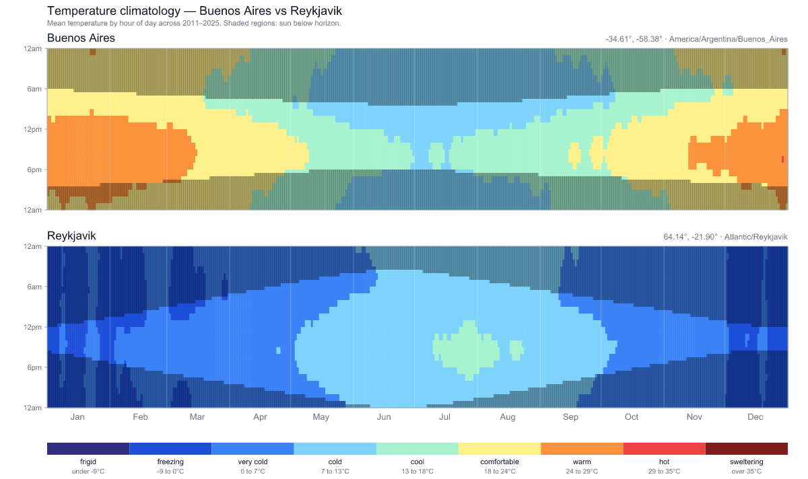
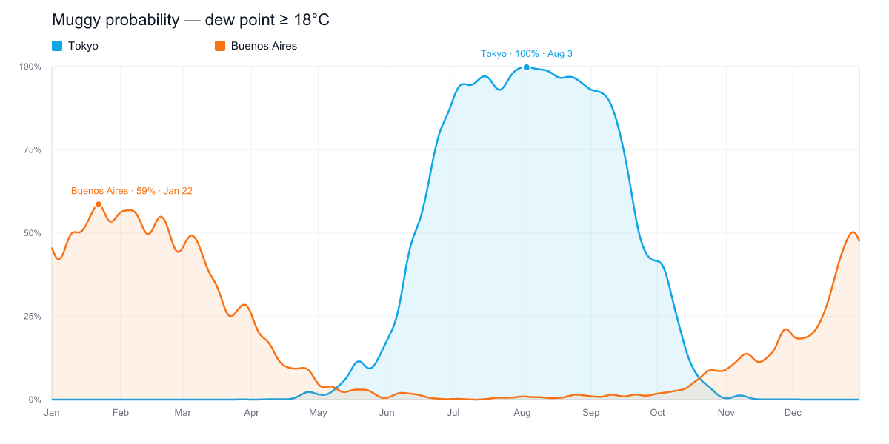

# atmosfera

A Discord bot that turns 15 years of hourly weather data into climate climatology charts for any city — temperature heatmaps, muggy probability, wet-day probability — plus AI-generated witty roasts of the climates it surfaces.



Top panel: Buenos Aires' diurnal cycle through the year — hot orange summer afternoons in January, cool cyan winter dawns in July. Bottom: Reykjavík maxes out at the green "cool" band, and the dark stripe at the top contracts almost to nothing in mid-June (polar-day effect). Twilight overlay marks hours when the sun is below the horizon.



The muggy-probability comparison: Tokyo's monsoon season hits 100% in early August (`tsuyu`), while Buenos Aires is the inverse-hemisphere mirror image with its peak in late January. Peak markers annotate the day and percentage automatically.

---

## Slash commands

| Command | What it does |
| --- | --- |
| `/climate <city>` | Temperature heatmap |
| `/muggy <city>` | Muggy probability (dew point ≥ 18°C) |
| `/wet <city>` | Wet-day probability (≥ 1 mm of rain) |
| `/compare <city_a> <city_b> [chart]` | Both cities side-by-side. `chart` choices: `heatmap`, `muggy`, `wetday`, `all` |
| `/roast <city>` | AI-generated witty climate roast, no chart |

Every chart command also accepts three optional roast options:

- `tone` — `affectionate`, `snarky` (default), `deadpan`, `dramatic`, `existential`
- `culture` — bool. When `true` (default), the roast may reference culture-meets-climate phenomena (`tsuyu`, siesta, sweater season, etc.)
- `length` — `1-sentence` (default), `2-sentences`, `paragraph`

Setting any of the three turns roasting on; the AI-generated text replaces the chart caption. Roasts are only available when `GEMINI_API_KEY` is set; otherwise commands behave normally.

**Disambiguation**: when a city name is ambiguous (e.g. "Columbia" — there are four in the US alone), the bot replies with an ephemeral dropdown so only the invoker sees the picker. A "save as alias" toggle persists the pick so the next time that user types the same query, it resolves instantly.

---

## Quickstart (self-host)

Requires [Bun](https://bun.sh) 1.3+ and a Discord application.

```bash
git clone https://github.com/saramaebee/atmosfera.git
cd atmosfera
bun install
cp .env.example .env
# Fill in DISCORD_TOKEN, DISCORD_CLIENT_ID, DISCORD_DEV_GUILD_ID, optional GEMINI_API_KEY
bun apps/discord-bot/src/index.ts
```

Slash commands register guild-scoped to `DISCORD_DEV_GUILD_ID` so they appear instantly in your dev server. Drop that env var and they'll register globally (1-hour propagation lag).

You can also iterate on charts without Discord:

```bash
bun run render "Tokyo" "Reykjavik" --chart heatmap --out out/tk-vs-rk.png
bun run render "Buenos Aires" --chart muggy
bun scripts/smoke/roast.ts   # generates out/roast-samples.md (needs GEMINI_API_KEY)
```

---

## Architecture

Bun + TypeScript monorepo. Bot is intentionally thin — the substance is in the packages.

```
apps/discord-bot/        Sapphire-framework Discord bot. Slash routing only.
packages/
  config/                zod-validated env + sqlite URL helper
  geocode/               Open-Meteo geocoder + qualifier parsing + dominance heuristics
  climate/               Historical fetch + climatology aggregation + Gaussian smoothing
  charts/                D3 + Resvg renderers (muggy, wet-day, temperature heatmap) + twilight overlay
  db/                    Drizzle ORM over bun:sqlite (cities, aliases) + migrations
  roast/                 Gemini-flavored climate roasts. Optional (no key = no roast).
scripts/
  render.ts              CLI driver — same renderers, no Discord roundtrip
  smoke/                 Resvg + roast quality gates
```

### Data flow

```
Open-Meteo geocode → cities table
Open-Meteo historical → .cache/raw/open-meteo/<lat>_<lon>/<year>.json
       ↓
climatology aggregation (15 years, 2011–2025) + Gaussian smoothing
       ↓
ClimateCube → .cache/cubes/<lat>_<lon>/cube-<version>.json
       ↓
chart renderers (SVG) + Resvg rasterizer
       ↓
.cache/charts/<sha1>.png → Discord attachment
```

- **Raw cache** is per `(location, year)` — one fetch per year per city, ever.
- **Cube cache** keys on `(location, cube version)`. Bumping `CUBE_VERSION` in `packages/climate/src/types.ts` automatically invalidates downstream charts and roasts.
- **Chart cache** keys on `(kind, lat, lon, cube version)`. Repeat commands skip Resvg entirely.
- **Roast cache** keys on `(mode, cubes, tone, culture, length)`. Same params on same cubes = same text forever.

### Why these choices

- **Bun** over Node — `bun:sqlite` (no native bindings, faster than `better-sqlite3`), faster startup, `.env` loading built in, Vitest-compatible `bun:test`. Phase 0 smoke-tested Resvg under Bun before committing the stack.
- **Open-Meteo** as the only weather provider — free, no key, well-documented, generous rate limits, returns local-time hourly data via `timezone=auto`.
- **SVG-first rendering** with D3 + Resvg — fast deterministic rasterization, no headless browser, no canvas native deps. Heatmap is ~17,000 SVG rects; rasterizes in ~500 ms.
- **Filesystem caches over a database** — climatology data is large and write-once; SQLite is for queryable state (cities, aliases). Mixing the two would make the schema noisy without performance benefit.
- **Gemini Flash** for roasts — generous free tier, same SDK swaps to Vertex AI on GCP, `thinkingBudget: 0` keeps output snappy and prevents mid-sentence truncation.

---

## Development

```bash
bun test                                   # 77 tests across 14 files
bun x tsc --noEmit -p tsconfig.json        # full repo typecheck
bun x biome check .                        # lint + format check
bun x biome format --write .               # autofix formatting
bun run render <city> [<city>] --chart <muggy|wetday|heatmap>   # CLI
```

Slash commands and library code live side by side; the CLI hits the same functions the bot does, so feature work can be iterated visually before being wired into Discord.

### Adding a new chart type

1. New file in `packages/charts/src/`. Add the renderer to `index.ts`.
2. Extend `ChartKind` in `packages/charts/src/cache.ts` so it gets PNG caching.
3. Wire into `apps/discord-bot/src/lib/charts.ts` (`buildRenderedMessage`).
4. Either: new `/commands/foo.ts` (single-purpose) or extend `/compare`'s `chart` choices.

### Bumping cube semantics

If you change smoothing, aggregation, or the cube schema:

1. Bump `CUBE_VERSION` in `packages/climate/src/types.ts`.
2. Cube files at `.cache/cubes/*/cube-<old>.json` become dead weight (safe to delete).
3. Chart cache + roast cache invalidate automatically (cube version is part of their keys).

---

## License

[Apache 2.0](LICENSE).
